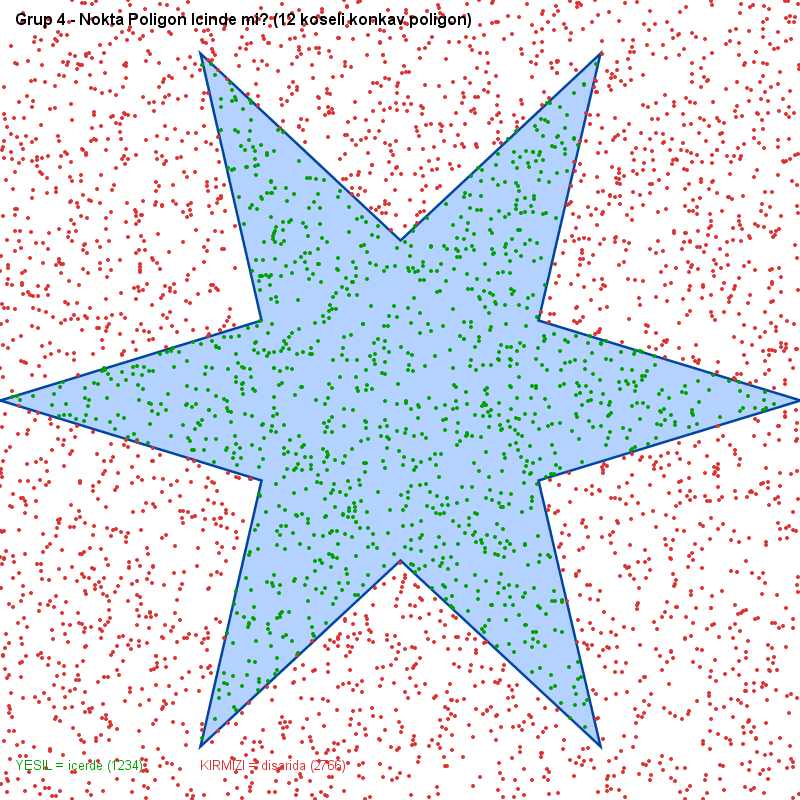

# Paralel Programlama Projesi — Grup 4
## Bir Noktanın Poligon İçinde Olup Olmadığının Paralel Tespiti

**Ders:** Paralel Programlama  
**Problem:** Konkav ya da konveks bir poligon (x, y köşe ikilileri) verildiğinde, bir
noktanın bu poligonun içinde olup olmadığını paralel programlama ile bulmak.  
**Tarih:** 12 Haziran 2026

### Ne Yaptık? (Özet)
Çok sayıda noktanın konkav/konveks bir poligonun içinde olup olmadığını **Ray Casting**
algoritmasıyla belirleyen bir program yazdık; bu işi önce **sıralı**, sonra Java
thread'leriyle **paralel** olarak yaptık ve iki yöntemin sürelerini ölçerek **hızlanma
katsayısını (speedup)** raporladık. Sonuçları konsol tablosu, CSV dosyası ve bir görsel
olarak çıktıladık.

### Neler Kullandık? (Teknolojiler ve Araçlar)

| Araç / Teknoloji | Kullanım amacı |
|------------------|----------------|
| Java 8 (JDK 1.8) | Programlama dili ve derleyici |
| `java.util.concurrent` (ExecutorService, Callable, Future) | Thread havuzu ile paralelleştirme ve sonuç toplama (redüksiyon) |
| Ray Casting algoritması | Bir noktanın poligon içinde olup olmadığını test etme |
| `System.nanoTime()` | Süre ölçümü (sıralı ve paralel) |
| Java AWT / `ImageIO` | Poligon ve noktaların PNG görseline çizilmesi |

---

## 1. Problemin Tanımı ve Çalışma Prensibi

Bir poligon, sıralı `(x, y)` köşe noktalarıyla tanımlanır. Amaç, verilen bir test
noktasının bu poligonun **içinde mi yoksa dışında mı** olduğunu belirlemektir. Bu temel
hesaplama; bilgisayar grafiği, coğrafi bilgi sistemleri (CBS), çarpışma testi ve harita
uygulamalarında sık kullanılır.

Kullandığımız yöntem **Ray Casting (Işın Gönderme)** algoritmasıdır:

> Test noktasından bir yöne (bizde +x yönüne) sonsuz bir ışın gönderilir. Bu ışının
> poligonun **kenarlarını kaç kez kestiği** sayılır. Kesişim sayısı **tek** ise nokta
> **içeride**, **çift** ise **dışarıdadır**.

Bu yöntemin en önemli avantajı, hem **konveks (dışbükey)** hem de **konkav (içbükey)**
poligonlarda doğru çalışmasıdır; poligonun girinti-çıkıntılı olması sonucu değiştirmez.
Testimizde bilinçli olarak **12 köşeli konkav (yıldız biçimli)** bir poligon kullanılmıştır.

### Neden paralelleştirmeye uygun?
Her test noktası **diğerlerinden tamamen bağımsız** olarak değerlendirilir. Bir noktanın
sonucu başka bir noktayı etkilemez. Bu, problemi *"utanç verici derecede paralel"
(embarrassingly parallel)* sınıfına sokar: noktaları thread'lere bölmek için kilit
(lock), karşılıklı dışlama veya thread'ler arası iletişim gerekmez. Tek senkronizasyon
noktası, en sonda her thread'in kısmi sayımının toplanmasıdır (redüksiyon).

---

## 2. Kullanılan Fonksiyonlar

| Fonksiyon | Görevi |
|-----------|--------|
| `nokativarMi(polyX, polyY, px, py)` | **Çekirdek algoritma.** Tek bir noktanın poligon içinde olup olmadığını Ray Casting ile döndürür. Poligonun her kenarı için ışın kesişimi kontrol edilir. |
| `sirali(...)` | **Sıralı çözüm.** Tüm test noktalarını tek thread ile, döngüyle test edip içeride olanları sayar. Karşılaştırma için temel (baseline) süreyi verir. |
| `paralel(..., threadSayisi)` | **Paralel çözüm.** Nokta dizisini `threadSayisi` kadar eşit parçaya böler; her parçayı `ExecutorService` üzerinden ayrı bir `Callable` ile işler. `Future.get()` ile kısmi sonuçlar toplanır (redüksiyon). |
| `yildizPoligon(...)` | Test için konkav (yıldız) bir poligon üretir; tek/çift köşelerde yarıçapı değiştirerek içbükey çıkıntılar oluşturur. |
| `main(...)` | Farklı nokta sayıları ve thread sayıları için süre ölçer, hızlanma katsayısını (speedup) hesaplayıp tablo halinde yazdırır. |

### Çekirdek algoritmanın kodu (özet)
```java
public static boolean nokativarMi(double[] polyX, double[] polyY, double px, double py) {
    int n = polyX.length;
    boolean icerde = false;
    for (int i = 0, j = n - 1; i < n; j = i++) {
        boolean yKesisiyor = (polyY[i] > py) != (polyY[j] > py);
        if (yKesisiyor) {
            double kesisimX = (polyX[j] - polyX[i]) * (py - polyY[i])
                            / (polyY[j] - polyY[i]) + polyX[i];
            if (px < kesisimX) icerde = !icerde; // her kesişimde durumu çevir
        }
    }
    return icerde;
}
```

---

## 3. Paralel Çözümün Açıklaması

Paralel çözümde **veri paralelliği (data parallelism)** uygulanmıştır. Çalışma adımları:

1. **Bölme (Partition):** `N` adet test noktası, `T` adet thread için yaklaşık eşit
   büyüklükte `T` parçaya bölünür. Her parça `[bas, son)` aralığıyla tanımlanır.
2. **Dağıtım:** Java `ExecutorService` (sabit boyutlu thread havuzu) ile her parça bir
   `Callable<Integer>` görevine verilir. Her görev, yalnızca kendi aralığındaki noktaları
   test edip yerel bir sayaç tutar — paylaşılan değişkene yazmadığı için kilit gerekmez.
3. **Redüksiyon (Reduction):** Tüm thread'ler bittiğinde, her birinin döndürdüğü kısmi
   sayım `Future.get()` ile toplanarak nihai "içeride nokta sayısı" elde edilir.

Bu tasarım sayesinde:
- **Paylaşılan yazılabilir durum yoktur** → veri yarışı (race condition) oluşmaz.
- Poligon dizileri (`polyX`, `polyY`) yalnızca **okunur**, bu yüzden tüm thread'ler
  güvenle paylaşır.
- İş yükü thread'lere dengeli dağıtılır (her thread ~N/T nokta işler).

**Doğruluk:** Programda her ölçümde sıralı ve paralel çözümün buldukları "içeride nokta
sayısı" karşılaştırılır; tüm testlerde sonuçlar **birebir aynı** çıkmıştır (`OK`). Bu,
paralelleştirmenin doğruluğu bozmadığını kanıtlar.

---

## 4. Deneysel Sonuçlar ve Hızlanma Katsayısı

**Test ortamı:** Windows 11, 8 mantıksal çekirdekli CPU, Java 1.8 (HotSpot). Her ölçüm
5 tekrarın ortalamasıdır; JIT derleyicisinin etkisini elemek için ölçümden önce "ısınma"
turu yapılmıştır. Rastgele noktalar sabit tohumla (seed=42) üretildiğinden sonuçlar
tekrar edilebilirdir.

> **Hızlanma katsayısı (Speedup) = Sıralı süre / Paralel süre**

### Program Çıktısı (Konsol)
Program çalıştırıldığında ürettiği çıktı (kısaltılmış):

```
============================================================
 GRUP 4 - Nokta Poligon Icinde mi? (Paralel Cozum)
============================================================
 CPU cekirdek  : 8   |   Thread sayisi : 8
 Algoritma     : Ray Casting (O(N * V))
------------------------------------------------------------
Nokta        | Sirali (ms)   | Paralel (ms)  | Speedup   | Icerde
------------------------------------------------------------
100          | 0,040         | 0,835         | 0,05      | 37 (OK)
10000        | 0,983         | 1,099         | 0,90      | 2975 (OK)
1000000      | 41,741        | 13,547        | 3,08      | 300251 (OK)
5000000      | 223,624       | 67,807        | 3,30      | 1501826 (OK)
------------------------------------------------------------
Olcumler CSV'ye yazildi: sonuclar.csv
```

"(OK)" işareti, her satırda sıralı ve paralel çözümün **aynı** sonucu bulduğunu
(doğruluğun korunduğunu) gösterir.

### Deney 1 — Nokta sayısının etkisi (8 thread sabit)

| Nokta sayısı | Sıralı (ms) | Paralel (ms) | **Speedup** | İçeride |
|-------------:|------------:|-------------:|------------:|--------:|
| 100          | 0.040       | 0.835        | **0.05**    | 37 |
| 1.000        | 0.231       | 0.837        | **0.28**    | 322 |
| 10.000       | 0.983       | 1.099        | **0.90**    | 2.975 |
| 100.000      | 4.226       | 2.460        | **1.72**    | 29.936 |
| 1.000.000    | 41.741      | 13.547       | **3.08**    | 300.251 |
| 5.000.000    | 223.624     | 67.807       | **3.30**    | 1.501.826 |

**Yorum:** Nokta sayısı arttıkça hızlanma katsayısı belirgin biçimde yükselir.
- **Küçük N (100–10.000):** Speedup < 1, yani paralel çözüm sıralıdan **yavaştır**.
  Çünkü thread havuzunu kurma, görev dağıtma ve `Future.get()` ile toplama gibi
  **sabit ek maliyetler (overhead)**, yapılan asıl işten daha pahalıdır.
- **Büyük N (≥100.000):** İş yükü ek maliyetleri çok aşar; speedup 1'i geçer ve
  5 milyon noktada **~3.3 kat** hızlanmaya ulaşır. Yani nokta sayısı 100 iken speedup
  0.05 iken, 5.000.000 noktada 3.30 olmuştur — paralelleştirme ancak yeterince büyük
  problemde kazançlıdır.

### Deney 2 — Thread sayısının etkisi (N = 5.000.000 sabit)

| Thread | Paralel (ms) | **Speedup** | Verimlilik (%) |
|-------:|-------------:|------------:|---------------:|
| 1      | 220.083      | **0.99**    | 98.8 |
| 2      | 174.794      | **1.24**    | 62.2 |
| 4      | 130.596      | **1.67**    | 41.6 |
| 8      | 84.739       | **2.57**    | 32.1 |

> Verimlilik (%) = Speedup / Thread sayısı (ideal = %100)
> (Referans sıralı süre: 217.4 ms)

**Yorum:** Thread sayısı arttıkça toplam süre düşer ve speedup yükselir (1.24 → 1.67 →
2.57). Ancak **verimlilik düşer**: 1 thread'de ~%99 iken 8 thread'de ~%32'ye iner. Bunun
nedenleri:
- **Amdahl Yasası:** Programın seri kalan kısımları (nokta dizisinin üretimi, görev
  dağıtımı, sonuçların toplanması) thread sayısı arttıkça oransal olarak darboğaza döner.
- **Donanım sınırları:** 8 "mantıksal" çekirdek genelde 4 fiziksel çekirdeğin
  Hyper-Threading ile ikiye katlanmasıdır; bu yüzden 8 thread, 8 kat hız vermez.
- **Bellek bant genişliği:** Algoritma nokta başına az işlem yapıp çok veri okuduğundan,
  thread'ler bellek erişiminde birbiriyle yarışır.

> **Not:** Mutlak süreler makinenin anlık yüküne göre çalıştırmalar arası ±%15–20
> değişebilir; eğilim (büyük N ve daha çok thread → daha yüksek speedup) tutarlıdır.
> Yukarıdaki tüm ölçümler `sonuclar.csv` dosyasına da yazılır (Excel'de grafik için).

### 4.3 Görsel Doğrulama (Çalışma Örneği)

Algoritmanın konkav poligonda doğru çalıştığı gözle de doğrulanmıştır. Aşağıdaki görselde
12 köşeli konkav (yıldız) poligon ve rastgele üretilen 4000 nokta gösterilmektedir:
poligon **içinde** kalan noktalar **yeşil**, **dışında** kalanlar **kırmızı**dır. Görüldüğü
gibi tüm yeşil noktalar yıldızın iç bölgesinde, tüm kırmızı noktalar dışında kalmaktadır —
girintili (içbükey) kenarlarda dahi sınıflandırma doğrudur.



Tek bir nokta da komut satırından sorgulanabilir; örnek çalışma:

```
> java NoktaPoligonIcinde nokta 500 500   ->  Nokta (500, 500) -> ICERIDE
> java NoktaPoligonIcinde nokta 10 10      ->  Nokta (10, 10)   -> DISARIDA
```

---

## 5. Sonuç

Bir noktanın konkav/konveks poligon içinde olup olmadığı problemi, Ray Casting
algoritmasıyla çözülmüş ve Java thread havuzu kullanılarak paralelleştirilmiştir.
Problem doğası gereği veri-paralel olduğundan, paralelleştirme **doğruluğu bozmadan**
(sıralı ve paralel sonuçlar birebir aynı) önemli hızlanma sağlamıştır:

- Yeterince büyük veride (5M nokta) **~3.3 kat** hızlanma elde edilmiştir.
- Hızlanma, **problem boyutu büyüdükçe** ve **thread sayısı arttıkça** yükselmiş; ancak
  paralel verimlilik, ek maliyetler ve donanım sınırları nedeniyle azalmıştır.
- Küçük veride paralelleştirmenin ek maliyeti kazançtan büyük olduğundan, paralel çözüm
  ancak belirli bir eşiğin üzerinde (≈100.000 nokta) avantajlı hâle gelmiştir.

Bu sonuçlar, paralel programlamanın temel ilkesini doğrular: **paralelleştirme bedavadır
değildir; kazanç ancak iş yükü, ek maliyeti aştığında ortaya çıkar.**
